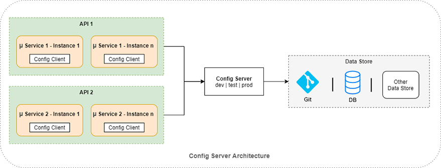

### 중앙 집중화된 구성 정보의 필요성
---

- MSA는 수백개의 서비스로 이루어질 수 있다. 이로 인해서 ***구성정보를 하나의 서비스에서 관리하지 않으면 값이 변경될 때 마다 관련되 있는 서비스들을 재배포*** 해야할 수 있다.
  - 수동으로 구성정보를 건드려야 한다면 구성 불일치나 예기치 않은 장애, 확장에 대한 지연 시간등이 발생할 수 있다.
- 때문에 구성정보를 관리하는 서비스를 따로 관리하여 구성 정보를 수많은 마이크로서비스가 내려받을 수 있게 해야한다.
  
### MSA에서 구성정보 서비스 구현 시 고려사항 
---

1. 배포되는 실제 코드와 구성 정보를 완전히 분리한다.
  - 분리 (Segregation) : 애플리케이션 구성 정보는 서비스 인스턴스와 함께 배포되어서는 안 되며, 시작 중인 서비스에 환경 변수로 전달되거나 서비스가 시작할 때 중앙 저장소에서 읽어 들여야 한다.
  - 중앙 집중화 (Centralize) : 구성 정보를 관리하는 서비스가 많아지면 서비스의 빌드 및 배포에 대한 복잡도가 올라가기 때문에, 최소한의 구성 정보 서비스를 운영해야 한다.
2. 여러 환경에서도 절대 변경되지 않으는 불변 애플리케이션 이미지를 빌드한다.
  - 견고성 (Harden) : 구성 정보 서비스는 여러 마이크로서비스에서 읽어들어오기 때문에 가용성이 높고 이중화가 필요한다. 
3. 서버가 시작할 때 마이크로서비스가 읽어 오는 환경 변수 또는 중앙 저장소를 통해 모든 애플리케이션 구성 정보를 주입한다.
  - 추상화 (Abstract) : 구성 데이터 접근 방식을 서비스 저장소(파일 기반 또는 JDBC 데이터베이스 기반)에서 직접 읽어오기 보다는 REST기반 JSON 서비스를 이용해야 한다.


### Spring Cloud Config 아키텍쳐
---



- 애플리케이션 구성 정보는 Git, File, DB등 데이터 저장소에 보관된다.
  - Spring Cloud Config Server에서는 디폴트가 Git으로 설정되어 있다.
- Spring Cloud Config Server는 데이터 저장소에서 구성 정보를 읽어들여 클라이언트에게 전달한다.
- Spring Boot Client는 애플리케이션이 로딩되면서 구성 서버에 구성 정보를 요청하고 읽어들여 구성 정보를 셋팅한다.
- 

### Spring Cloud Server에서 데이터를 전달하는 방식
--- 

- 데이터 저장소에서 데이터를 읽어들인 구성 서버는 해당 데이터를 클라이언트에게 전달할 수 있는 특정 URL을 제공한다.

#### resources form
```
/{application}/{profile}[/{label}]
/{application}-{profile}.yml
/{label}/{application}-{profile}.yml
/{application}-{profile}.properties
/{label}/{application}-{profile}.properties
```
- 
#### 예시 
```
curl localhost:8888/foo/development
curl localhost:8888/foo/development/master
curl localhost:8888/foo/development,db/master
curl localhost:8888/foo-development.yml
curl localhost:8888/foo-db.properties
curl localhost:8888/master/foo-db.properties
```
ㄴ

#### Reference 
> - [https://soshace.com/centralize-the-configuration-of-services-with-spring-cloud-config/](https://soshace.com/centralize-the-configuration-of-services-with-spring-cloud-config/) 
> - [스프링 마이크로서비스 코딩 공작소](http://www.yes24.com/Product/Goods/110243944)
> - [https://docs.spring.io/spring-cloud-config/docs/current/reference/html/](https://docs.spring.io/spring-cloud-config/docs/current/reference/html/)